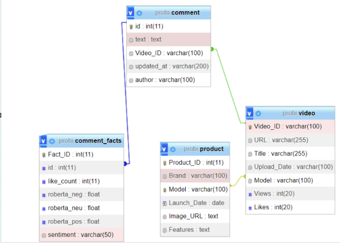
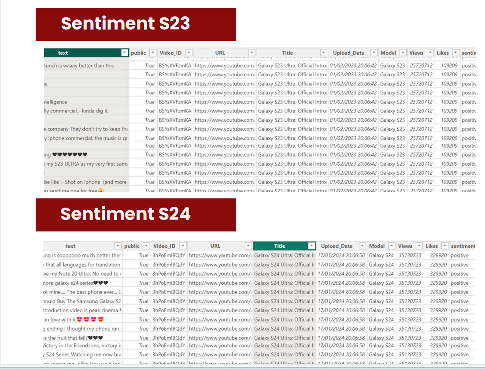
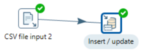
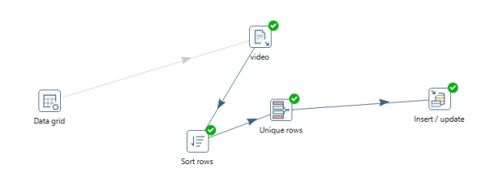
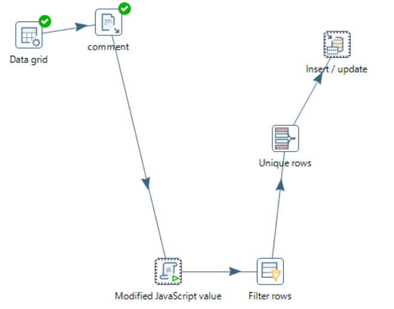
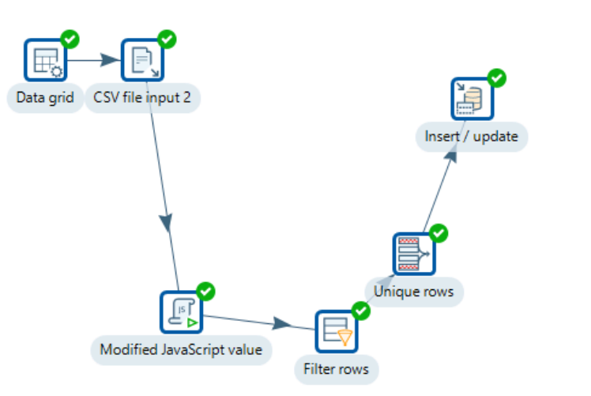
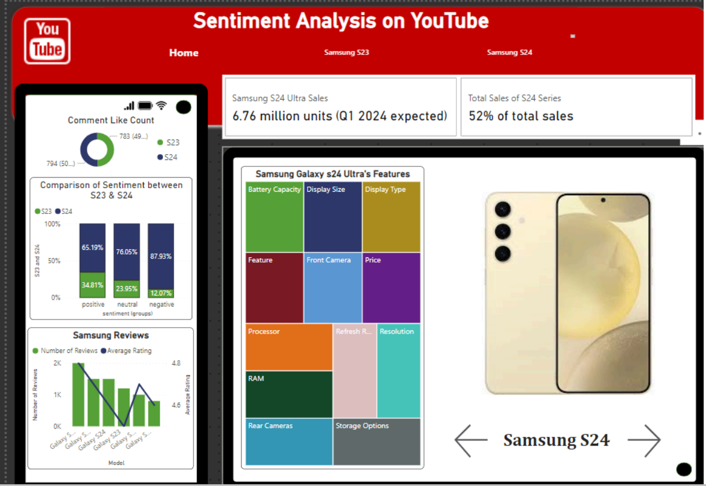
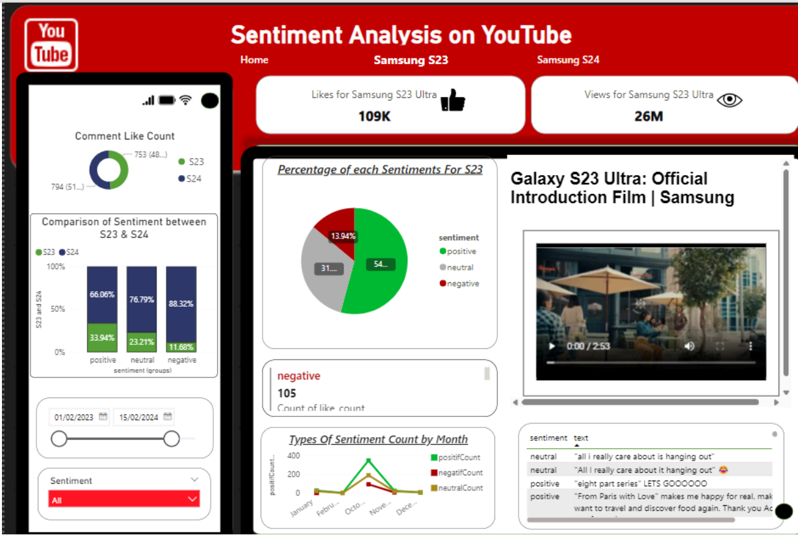

# Sentiment Analysis of Samsung S23 and S24 Products on YouTube

## Project Overview

Our study aims to understand the perception of Samsung S23 and Samsung S24 products on YouTube by analyzing the sentiments expressed in comments, as well as performance indicators such as the number of likes and views of associated videos. By examining these data, we aim to provide Samsung with valuable insights to refine their product development and marketing strategies, to better meet consumer expectations and enhance their competitiveness in the market.


## Table of Contents

1. [Project Overview](#project-overview)
2. [Data Warehouse](#data-warehouse)
3. [Dataset](#dataset)
4. [ETL with Pentaho](#etl-with-pentaho)
   - [Data Extraction](#data-extraction)
   - [Sentiment Analysis and Product Information Collection](#sentiment-analysis-and-product-information-collection)
   - [Data Cleaning and Transformation](#data-cleaning-and-transformation)
5. [Sentiment Analysis with Power BI](#sentiment-analysis-with-power-bi)
6. [How to Use](#how-to-use)
7. [Results](#results)
8. [Conclusion](#conclusion)
9. [References](#references)

## Data Warehouse

The data warehouse for this project serves as a central repository for storing and managing data collected from YouTube. It is designed to efficiently handle large volumes of data and support complex queries and analysis.

- **Warehouse Technology:** The data warehouse is built using a relational database management system (RDBMS) that supports scalable and reliable data storage.
- **Schema Design:** The data warehouse schema includes tables for comments, likes, views, and video metadata.



## Dataset

The dataset used in this project includes:

- **Comments:** Text data from YouTube comments related to Samsung S23 and Samsung S24 products.
- **Likes and Views:** Performance indicators such as the number of likes and views for each video.
- **Metadata:** Additional information about each video, such as upload date and video title.

The dataset was collected from YouTube and imported into the data warehouse for analysis.



## ETL with Pentaho


### Data Extraction

To extract data from YouTube videos, we utilized the YouTube API. This API allows us to retrieve various information about the videos and associated comments. Extracted information includes:

- **author:** The author of the comment
- **updated_at:** The date the comment was updated
- **like_count:** The number of likes on the comment
- **text:** The text of the comment
- **public:** The visibility of the comment (public or private)
- **Video_ID:** The unique identifier of the video
- **URL:** The URL of the video
- **Title:** The title of the video
- **Upload_Date:** The upload date of the video
- **Model:** The product model discussed in the video
- **Views:** The number of views of the video
- **Likes:** The number of likes of the video


### Sentiment Analysis and Product Information Collection

#### Sentiment Analysis

For analyzing the sentiments of the comments, we used the natural language processing model: `cardiffnlp/twitter-roberta-base-sentiment`. This model categorizes comments into three sentiment categories: positive, negative, or neutral.


### Data Cleaning and Transformation

#### 1. Transformation "Product"

- **Data Reading:** Utilized a CSV file input to read product information.
- **Unique Row Processing:** Filtered out duplicates to ensure each product is unique.
- **Insertion/Update:** Inserted or updated the processed data in the target database.


#### 2. Transformation "Video"

- **Data Reading:** Imported video data from sources such as data grids and CSV files.
- **Unique Row Processing:** Removed duplicates to ensure unique video records.
- **Insertion/Update:** Inserted or updated the data in the target database.



#### 3. Transformation "Comment"

- **Data Reading:** Utilized data grids to read comments.
- **Row Sorting:** Sorted data based on specific criteria.
- **Unique Row Processing:** Filtered duplicates to ensure unique comments.
- **Insertion/Update:** Inserted or updated the data in the target database.



#### 4. Transformation "Facts"

- **Data Reading:** Used data grids to read factual information.
- **Value Modification with JavaScript:** Applied JavaScript scripts to transform certain data values.
- **Row Filtering:** Removed rows that did not meet certain criteria.
- **Unique Row Processing:** Filtered duplicates to ensure unique records.
- **Insertion/Update:** Inserted or updated the processed data in the target database.




## Sentiment Analysis with Power BI

We performed sentiment analysis using Power BI. The steps involved are:

1. **Data Import:** Loading the cleaned data from the data warehouse into Power BI.
2. **Data Transformation:** Using Power Query to prepare the data for analysis.

3. **Sentiment Visualization:** Creating visualizations to display sentiment distribution and trends over time.





## How to Use

1. **Clone the Repository:**
    ```bash
    git clone https://github.com/yourusername/samsung-s23-s24-sentiment-analysis.git
    ```

2. **Install Dependencies:**
    - Ensure you have Power BI and Pentaho Data Integration installed.

3. **Load Data into Pentaho:**
    - Use the provided Pentaho transformation files to perform ETL operations.

4. **Load Data into Power BI:**
    - Open the Power BI file (`.pbix`) provided in this repository.
    - Import the cleaned data and use the Power BI dashboard to visualize the results.

## Results

The sentiment analysis and performance indicators revealed key insights into how the Samsung S23 and S24 products are perceived on YouTube. For example:

- **Samsung S23** received more positive feedback compared to **Samsung S24**.
- **Videos about Samsung S24** had higher engagement in terms of likes and views.


## Conclusion

Le Galaxy S24 Ultra montre une meilleure réception et un plus grand engagement que le S23 Ultra.
Les ventes prévues et les améliorations des caractéristiques du S24 Ultra suggèrent une réponse positive du marché et une satisfaction accrue des utilisateurs.

## References

- [YouTube Data API](https://developers.google.com/youtube/v3)
- [Pentaho Data Integration Documentation](https://help.pentaho.com/Documentation/8.2/Products/Data_Integration)
- [Power BI Documentation](https://docs.microsoft.com/en-us/power-bi/)


